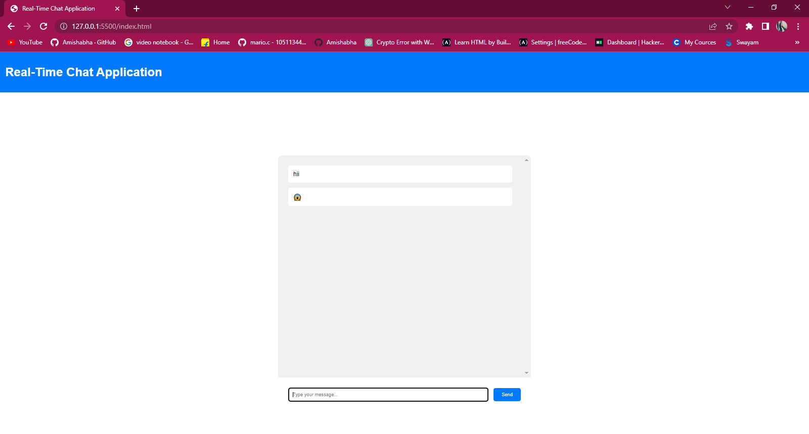

##About Project
The Real-Time Chat Application is a web-based platform that enables users to communicate with each other in real-time using text messages. It provides a seamless and interactive chatting experience, fostering instant communication and collaboration between users. The application utilizes HTML, CSS, and JavaScript to create an attractive and user-friendly interface.

##Key Features
1.Emojis and File Sharing: The application supports the use of emojis in messages and allows users to share files such as images or documents.

2.Message Notifications: Users receive notifications for new messages, ensuring that they stay updated with the ongoing conversations.

3.User Presence Status: The application displays the online/offline status of users, indicating their availability for chat.

4.Message History: The chat application maintains a message history, allowing users to scroll back and view previous conversations.
